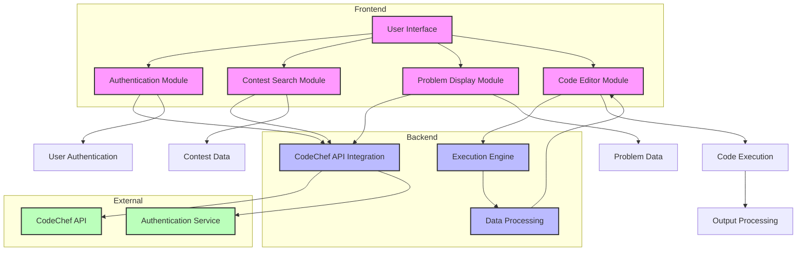

# CodEngine - Interactive Online Judge Platform

A modern, interactive online judge platform that leverages the CodeChef API to provide a seamless coding experience.

## 🚀 Features

- 📱 Responsive and intuitive user interface
- 🔐 Secure authentication using CodeChef API
- 🔍 Advanced contest search functionality
- 📚 Comprehensive problem statements
- 📝 Integrated code editor with syntax highlighting
- 🔄 Real-time code execution and output
- 🏆 Contest participation and problem solving

## 🏗️ System Architecture



## 📸 Screenshots

### 🏠 Home Page


### 🔐 Authentication


### 🔍 Contest Search


### 📋 Contest Page


### 📖 Problem Statement


### 💻 Code Editor


### 📝 Text Editor


### 📥 Input Page


### 🔄 Run Page


## 🛠️ Tech Stack

- **Frontend**: React.js
- **Backend**: Node.js
- **API**: CodeChef API
- **UI Components**: Modern CSS/HTML
- **Code Editor**: Custom implementation with syntax highlighting

## 📁 Project Structure



```mermaid
graph TD
    A[Root Directory]
    A --> B[src]
    A --> C[public]
    A --> D[server]
    A --> E[firebase]
    A --> F[Images]
    A --> G[package.json]
    A --> H[package-lock.json]
    A --> I[README.md]
    A --> J[.gitignore]

    B --> K[components]
    B --> L[pages]
    B --> M[utils]
    B --> N[styles]
    B --> O[config]

    K --> P[Auth]
    K --> Q[Contest]
    K --> R[Problem]
    K --> S[Editor]

    L --> T[Home]
    L --> U[Login]
    L --> V[Search]
    L --> W[Contest]
    L --> X[Problem]
    L --> Y[Code]

    D --> Z[server.js]
    D --> AA[config]
    D --> AB[routes]

    E --> AC[config]
    E --> AD[functions]
    E --> AE[index.js]

    F --> AF[front-view.png]
    F --> AG[Login-page.png]
    F --> AH[Search-page.png]
    F --> AI[Contest-page.png]
    F --> AJ[Problem-page.png]
    F --> AK[Code-page.png]
    F --> AL[Text-editor.png]
    F --> AM[Input-page.png]
    F --> AN[Run-page.png]

    classDef folder fill:#f9f,stroke:#333,stroke-width:2px
    classDef file fill:#bbf,stroke:#333,stroke-width:2px
    classDef image fill:#bfb,stroke:#333,stroke-width:2px
    
    class A,B,C,D,E,F,K,L,M,N,O,P,Q,R,S,T,U,V,W,X,Y,Z,AA,AB,AC,AD,AE folder
    class G,H,I,J,Z,AA,AB,AC,AD,AE file
    class AF,AG,AH,AI,AJ,AK,AL,AM,AN image
```

## 📦 Installation

1. Clone the repository:
```bash
git clone https://github.com/yourusername/CodEngine.git
```

2. Install dependencies:
```bash
npm install
```

3. Set up environment variables:
```bash
cp .env.example .env
# Edit .env with your CodeChef API credentials
```

4. Start the development server:
```bash
npm start
```

## 🤝 Contributing

Contributions are welcome! Please feel free to submit a Pull Request.

## 📝 License

This project is licensed under the MIT License - see the LICENSE file for details.

## 🙏 Acknowledgments

<br/>
Happy Coding!!!
